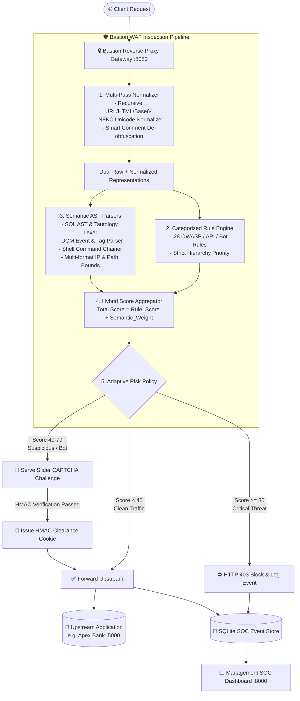

<div align="center">

# 🛡️ Bastion WAF

**Next-Gen Web Application Firewall featuring SafeLine-Inspired Semantic AST Analysis & 3-Tier Adaptive Bot Challenges**

[](https://github.com/FinsterNet/BastionWAF/actions)
[](https://www.python.org/)
[](https://github.com/FinsterNet/BastionWAF)
[](LICENSE)
[](https://owasp.org)
[](https://github.com/FinsterNet/BastionWAF)

[Features](#-key-features) • [Architecture](#-architecture) • [Quick Start](#-quick-start) • [Rule Coverage](#-security-rule-coverage-28-rules) • [Docker](#-docker-deployment) • [Testing](#-automated-testing)

---

</div>

## 📌 Overview

**Bastion WAF** is an enterprise-grade, high-performance Web Application Firewall built in Python. Unlike conventional regex-based WAFs that trigger false alarms on conversational text, arithmetic formulas, or database queries, Bastion WAF implements a **context-aware lexical tokenizer and AST grammar analysis engine** inspired by Chaitin SafeLine.

It combines semantic syntax validation, signature scoring, multi-pass recursive decoders, and a **3-tier adaptive Slider CAPTCHA challenge** to safeguard web applications and APIs from zero-day exploits, evasions, and automated bot swarms.

---

## 🚀 Key Features

- **🧠 SafeLine-Inspired Semantic AST Engine**: Parses payloads into abstract syntax trees and evaluated grammar tokens (SQL, HTML/JS, Shell, Path Canonicalization, Multi-format IP) to evaluate *true execution intent* rather than blind keyword matching.
- **⚡ Zero False Positives**: Cleanly permits natural language (`"select goods from store"`, `"1 < 2 in math class"`, `"curl up with a book"`) while blocking evasive bypasses.
- **🧩 3-Tier Adaptive Response Policy**:
  - **Tier 1 (Critical Exploits)**: Immediate `HTTP 403 Forbidden` hard block.
  - **Tier 2 (Suspicious Surges / Bot Scanners)**: Intercepts traffic with a sleek, dark-themed **Slider CAPTCHA Challenge**.
  - **Tier 3 (Verified / Clean Traffic)**: Grants a cryptographically signed HMAC clearance token (`bastion_waf_clearance`, 15-min TTL) and forwards seamlessly upstream.
- **🛡️ 28 Active Categorized Rules**: Complete defense across OWASP Top 10, OWASP API Security, and Automated Bot / DoS threats.
- **🔄 Multi-Pass Normalization Layer**: Recursively resolves multi-stage URL encodings, HTML entities, Base64 chunks, Unicode NFKC homoglyphs, and split-comment evasion (`UNI/**/ON`).
- **📊 Real-Time SOC Management Dashboard**: Dark-themed monitoring UI displaying live QPS telemetry, attack timelines, dynamic rule toggles, site manager, and request inspection payloads.
- **⚡ High-Throughput Async Reverse Proxy Gateway**: Built on Starlette/FastAPI and HTTPX with streaming support and configurable upstream balancing.

---

## 🏛️ Architecture



---

## 🥊 Traditional Regex WAF vs. Bastion Semantic Engine

| Threat / Test Vector | Conventional Regex WAF | Bastion WAF (Semantic AST) | Verdict |
| :--- | :---: | :---: | :---: |
| `"Can you select goods from store?"` | ❌ **Blocked** (False Positive) | ✅ **Allowed** (Clean English) | **Bastion Wins** |
| `1 < 2 in mathematics` | ❌ **Blocked** (False Positive) | ✅ **Allowed** (Clean Math) | **Bastion Wins** |
| `UNI/**/ON/**/SEL/**/ECT` | ⚠️ Bypassed (Evasion) | ⛔ **Blocked** (Lexer Joiner) | **Bastion Wins** |
| `0177.0.0.1` (Octal IP SSRF) | ⚠️ Bypassed (Regex missed) | ⛔ **Blocked** (Multi-Format IP) | **Bastion Wins** |
| `c'a't /etc/passwd` | ⚠️ Bypassed (Quote Splitting) | ⛔ **Blocked** (Shell AST Lexer) | **Bastion Wins** |
| Bot Scanner Burst (`sqlmap`/`nikto`) | ❌ Dumb 403 or server lag | 🧩 **Adaptive Slider Challenge** | **Bastion Wins** |

---

## 🛡️ Security Rule Coverage (28 Rules)

### Category 1: OWASP Top 10 Web Application Security
- `942100` **SQL Injection Shield**: Semantic AST validation of UNION queries, boolean tautologies, stacked DDL/DML, and time blinds.
- `941100` **Cross-Site Scripting Filter**: Context-aware blocking of `<script>`, event handlers (`onload=`, `onerror=`), and `javascript:` URIs.
- `930120` **Path Traversal / LFI Guard**: Evaluates canonical directory breakout (`../`, `/etc/passwd`, `/proc/self/`).
- `932100` **Remote Code Execution Engine**: Mitigates chained commands (`; whoami`, `| cat`), subshells `$(...)`, and backticks.
- `934100` **SSRF Guard**: Restricts loopbacks, RFC 1918 subnets, cloud metadata (`169.254.169.254`), and multi-format IP evasions.
- `933100` **Server-Side Template Injection**: Detects template delimiters (`{{...}}`, `${...}`) and Jinja2 sandbox escapes.
- `933200` **XML External Entity (XXE) Shield**: Mitigates DTD external entity declarations (`SYSTEM "file://..."`).
- `933300` **Insecure Deserialization**: Intercepts Java serialized payloads (`rO0AB...`), PHP `O:4:"User"...`, and Python pickle opcodes.
- `933400` **Malicious File Upload / Webshell Guard**: Intercepts executable extensions (`.php`, `.jsp`, `.sh`) and inline webshells.
- `933500` **JNDI / Log4j Lookup Shield**: Neutralizes Log4Shell (`${jndi:ldap://...}`), Spring4Shell, and nested lookup evasions.
- `933600` **JavaScript Prototype Pollution Filter**: Blocks `__proto__`, `constructor.prototype`, and accessor pollution.
- `921100` **CRLF Injection & Request Smuggling**: Blocks `\r\n` injection and conflicting `Transfer-Encoding` / `Content-Length`.
- `935100` **Open Redirect Guard**: Intercepts protocol-relative `//evil.com` and user-info credential redirect bypasses.
- `942200` **LDAP & XPath Injection**: Mitigates LDAP filter tautologies `(&(attr=*))` and XPath injection syntax.
- `930200` **Sensitive Config Snooping**: Blocks automated probing for `.env`, `.git`, cloud keys, and database dumps.

### Category 2: API Security & Abuse Protection
- `950100` **API Mass Assignment Guard**: Blocks unauthorized privilege escalation fields (`"role": "admin"`) in JSON bodies.
- `950200` **GraphQL Introspection & Depth Guard**: Blocks schema extraction (`__schema`, `__type`) and deep recursive queries (>8 levels).
- `950300` **Secret Key & Token URI Leakage**: Detects sensitive API keys and access tokens exposed in GET query parameters.
- `950400` **HTTP Verb & Method Tampering**: Blocks diagnostic/insecure HTTP methods (`TRACE`, `TRACK`, `DEBUG`, `CONNECT`).
- `950500` **JSON/XML Payload Bomb Guard**: Mitigates deeply nested payloads (>15 levels) designed for DoS CPU/memory exhaustion.
- `950600` **CORS Origin Abuse Guard**: Intercepts sandboxed `Origin: null` exploitation on state-modifying requests.
- `950700` **JWT None-Algorithm & Signature Tampering**: Intercepts unsigned `"alg": "none"` tokens and stripped signatures.

### Category 3: Bot Protection & Automated Threat Management
- `960100` **Vulnerability Scanner Signatures**: Identifies `sqlmap`, `nikto`, `masscan`, `nuclei`, `gobuster`, and `burpcollaborator`.
- `960200` **Headless Automation Framework Guard**: Detects headless automation browsers (`HeadlessChrome`, `Puppeteer`, `Selenium`).
- `960300` **Sliding-Window CC Flood & Rate Limiter**: Per-client in-memory sliding window rate limiter mitigating flood surges.
- `960400` **Credential Stuffing & Default Credentials**: Blocks brute-forcing with common credentials (`admin/admin`, `root/toor`).
- `960500` **HTTP Header Anomaly & Protocol Violation**: Intercepts missing or empty `User-Agent` headers and malformed headers.
- `960600` **Cryptomining Script & Stratum Blocker**: Blocks in-browser WebAssembly crypto miners and Stratum pool connections.

---

## 🏁 Quick Start

### Prerequisites
- Python 3.11, 3.12, 3.13, or 3.14
- Linux, macOS, or Windows WSL2

### 1. Clone & Set Up
```bash
git clone git@github.com:FinsterNet/BastionWAF.git
cd BastionWAF/waf

# Create virtual environment
python3 -m venv venv
source venv/bin/activate

# Install dependencies
pip install -r requirements.txt
```

### 2. Launch Services
Run the launcher script to spin up the WAF Reverse Proxy and SOC Dashboard:
```bash
chmod +x start.sh
./start.sh
```

Or run using Python directly:
```bash
python3 main.py
```

### 3. Service Access Points

| Service | Port | Description |
| :--- | :---: | :--- |
| **WAF Reverse Proxy Gateway** | `http://127.0.0.1:8080` | Filters all inbound traffic and proxies clean requests to your application. |
| **WAF SOC Security Dashboard** | `http://127.0.0.1:8000` | Real-time threat visualizer, rule toggles, live QPS charts, and event inspector. |
| **Upstream Target App** (Optional) | `http://127.0.0.1:5000` | Included Apex Global Bank simulation lab. |

---

## 🐳 Docker Deployment

Run the complete Bastion WAF stack with a single command:

```bash
docker compose up -d
```

Services will be accessible immediately:
- **Proxy Gateway**: `http://localhost:8080`
- **SOC Dashboard**: `http://localhost:8000`

---

## 🧪 Automated Testing

Bastion WAF is backed by an extensive test suite covering semantic AST edge cases, evasion payloads, and false positive prevention:

```bash
cd waf
pytest -v
```

```text
======================== 103 passed, 1 warning in 4.21s ========================
```

---

## 📁 Repository Structure

```text
BastionWAF/
├── .github/
│   ├── workflows/
│   │   └── ci.yml              # Automated GitHub Actions CI Test Suite
│   └── ISSUE_TEMPLATE/         # Bug report & feature request templates
├── waf/
│   ├── api/                    # SOC Dashboard REST API & telemetry endpoints
│   ├── bastion/
│   │   ├── challenge/          # 3-Tier Slider CAPTCHA & HMAC verification engine
│   │   ├── core/               # Reverse proxy, normalizer, inspector & scoring engine
│   │   ├── rules/              # 28 categorized OWASP, API, and bot defense rules
│   │   └── semantic/           # SafeLine-inspired AST grammar & semantic analyzers
│   ├── config/                 # Dynamic rule configs and proxy settings
│   ├── dashboard/              # Single-page real-time SOC monitoring interface
│   ├── database/               # SQLite event database and CRUD layer
│   ├── tests/                  # 103 pytest unit and integration tests
│   ├── vulnerable_target/      # Apex Global Bank simulation target
│   ├── main.py                 # Multi-service process orchestrator
│   ├── requirements.txt        # Python package dependencies
│   └── start.sh                # Zero-config launch script
├── Dockerfile                  # Production container definition
├── docker-compose.yml          # Multi-container orchestration spec
├── CONTRIBUTING.md             # Contribution guidelines
├── SECURITY.md                 # Security disclosure policy
├── LICENSE                     # MIT License
└── README.md                   # Repository documentation
```

---

## 🤝 Contributing

Contributions are warmly welcome! Please review our [Contributing Guidelines](CONTRIBUTING.md) to get started on submitting new rules, semantic parsers, or UI enhancements.

---

## 📄 License

Distributed under the **MIT License**. See [`LICENSE`](LICENSE) for details.

Developed with ❤️ by **[FinsterNet](https://github.com/FinsterNet)**.
